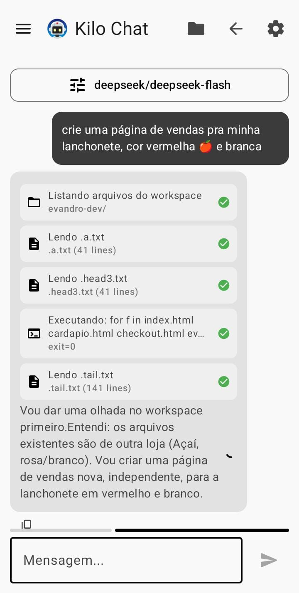
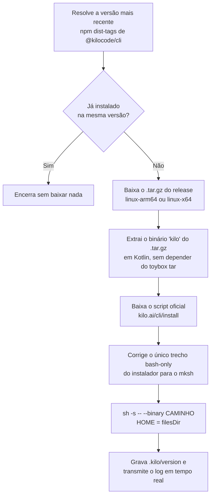

<div align="center">


# Fusion CLI

**O Kilo Code rodando nativo no seu Android.**
Instala o CLI oficial, conversa com o agente e deixa ele mexer nos arquivos do celular.

<a href="https://github.com/git-evandro/fusion-cli/releases/latest/download/fusion-cli-1.0.apk">

</a>

[](https://github.com/git-evandro/fusion-cli/releases)
[](#licen%C3%A7a)
[](#requisitos)
[](https://kotlinlang.org)

<table>
<tr>
<td align="center" valign="top">

</td>
<td align="center" valign="top">

</td>
</tr>
</table>

<sub>Uso real no celular: um pedido em português virou um site completo, sem tocar em um computador.</sub>

</div>

---

## O que é

O Fusion CLI é um app Android que traz o **Kilo Code** — o agente de código open source da
[Kilo Org](https://github.com/Kilo-Org/kilocode) — para dentro do celular, sem precisar de
Termux, root ou um computador no meio do caminho.

O app faz o trabalho pesado que o instalador oficial não consegue fazer sozinho no Android
(o shell padrão é `mksh`, não existe `bash` nem `curl`), baixa o binário certo pro seu aparelho
e sobe uma interface Compose para você instalar, conversar e deixar o agente trabalhar nos
arquivos de um workspace real em `/sdcard/FusionCLI`.

---

## Do pedido ao resultado

As duas imagens lá em cima são dessa mesma sessão. O pedido foi
_"crie uma página de vendas pra minha lanchonete, cor vermelha e branca"_.

Repare no print à esquerda que o agente **não inventou nada**: ele leu `.a.txt`, `.head3.txt` e
`.tail.txt`, rodou um comando para conferir os HTMLs existentes (`exit=0`) e só então escreveu.
É esse ciclo de *ler → decidir → executar → verificar* que aparece no chat a cada passo.

---

## Destaques

| | |
|---|---|
| **Instalação em um toque** | Baixa, valida e instala o Kilo Code oficial (`@kilocode/cli`) direto do GitHub Releases, com log ao vivo de tudo. |
| **Agente de verdade, não só chat** | O modelo recebe 8 ferramentas e opera no filesystem: listar, ler, escrever, editar, mover, apagar, criar pastas e executar comandos de shell. |
| **Loop de ferramentas** | Até 12 rodadas autônomas por pergunta — o agente executa, lê o resultado e continua até resolver. |
| **Respostas em streaming** | Chat compatível com OpenAI (`stream: true`) com tool calling acumulado token a token. |
| **19 provedores prontos** | DeepSeek, OpenAI, Anthropic, Gemini, Mistral, xAI, Groq, OpenRouter, Together, Cohere, Perplexity, Cerebras, Fireworks, Moonshot, Z.AI, Qwen, Baidu, ByteDance e o gateway do Kilo — ou qualquer endpoint compatível. |
| **Console ao vivo** | Todo o stdout/stderr do instalador e dos comandos, com sequências ANSI limpas para ficar legível. |
| **Instala em segundo plano** | Foreground service + notificação: você pode sair do app durante o download de ~100 MB. |
| **Layout adaptativo** | Material 3 Expressive com `ListDetailPaneScaffold` — celular usa pilha, tablet usa dois painéis. |

---

## Como funciona a instalação

O instalador oficial assume `bash` + `curl`. No Android nenhum dos dois existe, então o app
reimplementa o pipeline em Kotlin:



Dois detalhes que fazem isso funcionar onde outros apps quebram:

- **O `tar` do Android é o toybox**, que sai com código de erro ao tentar `chown` em arquivos do
  usuário. Por isso o `.tar.gz` é desempacotado em Kotlin puro, lendo os headers de 512 bytes
  direto do `GZIPInputStream`.
- **O `mksh` valida a sintaxe do script inteiro antes de executar.** Um `[[ ... =~ ... ]]` dentro
  de um `if` que nunca roda ainda derruba o script todo — por isso a linha é reescrita para uma
  forma POSIX antes do `sh` receber o arquivo.

O que sobra é o instalador **oficial**, executado no modo `--binary` que ele já suporta. Nada de
mirror ou build de terceiros.

---

## Ferramentas do agente

O agente não responde só com texto: ele chama funções e o app executa no workspace.

| Ferramenta | O que faz |
|---|---|
| `list_files` | Lista recursivamente tudo no workspace |
| `read_file` | Lê um arquivo de texto |
| `write_file` | Cria ou sobrescreve um arquivo |
| `edit_file` | Substitui um trecho exato (com opção `replace_all`) |
| `move_file` | Move ou renomeia arquivo/pasta |
| `delete_file` | Apaga arquivo ou pasta (recursivo) |
| `create_dir` | Cria pasta com os pais que faltarem |
| `run_command` | Roda comando de shell com o workspace como diretório de trabalho |

Cada chamada aparece no chat em tempo real — _"Editando src/main.kt"_, _"Executando: ./gradlew assembleDebug"_ —
para você acompanhar o que está sendo mexido.

---

## Telas

| Tela | Função |
|---|---|
| **Dashboard** | Status do sistema, versão instalada do Kilo, botão de instalação em um toque, cópia de logs e atalhos. |
| **Live Console** | Stream do instalador com auto-scroll e cores de terminal. |
| **Chat with Kilo** | Conversa com streaming, escolha de provedor/modelo e visualização das chamadas de ferramenta. |
| **Agent Workspace** | Navegação nos arquivos em `/sdcard/FusionCLI` criados pelo agente. |

---

## Requisitos

- **Android 7.0 (API 24)** ou superior
- **Aparelho 64 bits** — os releases do Kilo são publicados só para `arm64-v8a` e `x86_64`
- **~150 MB livres** para o download e a extração
- Permissão de **acesso a todos os arquivos**, necessária para o workspace em `/sdcard/FusionCLI`
- Uma **API key** de um dos provedores suportados (ou do gateway do Kilo)

---

## Como compilar

```bash
git clone <url-do-repo>
cd FusionCLI

# Windows
gradlew.bat assembleDebug

# Linux / macOS
./gradlew assembleDebug
```

O APK sai em `app/build/outputs/apk/debug/app-debug.apk`.

Requisitos de build: Android SDK com compileSdk 37, JDK 11+ e Gradle Wrapper (já incluso).

---

## Estrutura do projeto

```
app/src/main/java/com/example/fusioncli/
├── data/                  # Modelos, settings, workspace e o instalador
│   ├── AgentTools.kt      # Schemas das ferramentas expostas ao modelo
│   ├── InstallManager.kt  # Instalador com escopo de aplicação
│   └── WorkspaceRepository.kt
├── repository/
│   ├── CommandRepository.kt  # Pipeline de download + extração + execução
│   └── KiloChatRepository.kt # Chat streaming com loop de ferramentas
├── service/               # Foreground service e notificações
└── ui/
    ├── chat/              # Chat, seleção de provedor e modelo
    ├── dashboard/         # Dashboard e console ao vivo
    ├── workspace/         # Navegador de arquivos
    └── theme/             # Tema Material 3
```

---

## Privacidade

O Fusion CLI **não tem servidor próprio e não coleta nada**. Ponto a ponto:

- Suas API keys ficam **só no aparelho**, em DataStore local — nunca saem para outro lugar além
  do provedor que você configurou.
- O agente roda comandos **dentro** de `/sdcard/FusionCLI`, com `HOME` apontando para os arquivos
  internos do app.
- O app fala com quatro domínios, todos oficiais: `kilo.ai`, `registry.npmjs.org`,
  `github.com/Kilo-Org/kilocode` e a API do provedor que você escolher.

---

## Aviso

O agente executa comandos de shell de verdade e pode escrever e apagar arquivos no workspace.
Revise as chamadas de ferramenta no chat antes de deixar o agente rodando solto em pastas com
conteúdo importante.

---

## Licença

[MIT](LICENSE) — pode usar, modificar, redistribuir e vender, desde que mantenha o aviso de
copyright.

O Kilo Code é um projeto independente da [Kilo Org](https://github.com/Kilo-Org/kilocode) e
mantém a licença própria dele. O Fusion CLI é um cliente Android não oficial.
