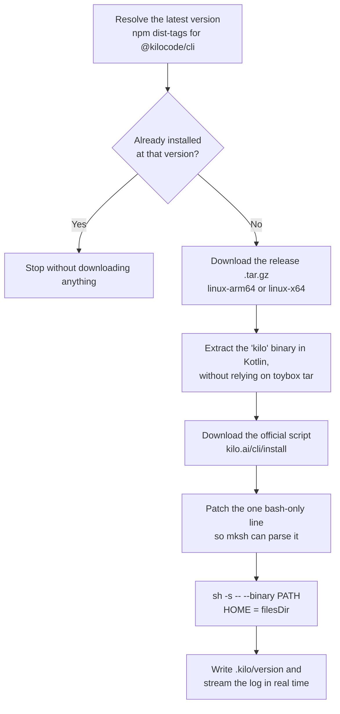

<div align="center">


# Fusion CLI

**Kilo Code running natively on your Android.**
It installs the official CLI, talks to the agent, and lets it work on your phone's files.

**English** · [Português (BR)](README.pt-BR.md)

<a href="https://github.com/git-evandro/fusion-cli/releases/latest/download/fusion-cli-1.0.apk">

</a>

[](https://github.com/git-evandro/fusion-cli/releases)
[](LICENSE)
[](#requirements)
[](https://kotlinlang.org)

<table>
<tr>
<td align="center" valign="top">

</td>
<td align="center" valign="top">

</td>
</tr>
</table>

<sub>Real use on a phone: one prompt in Portuguese produced a complete website, without touching a computer.</sub>

</div>

---

## What it is

Fusion CLI is an Android app that brings **Kilo Code** — the open-source coding agent from
[Kilo Org](https://github.com/Kilo-Org/kilocode) — onto the phone itself. No Termux, no root,
no computer in the middle.

The app does the heavy lifting the official installer cannot do on Android on its own (the stock
shell is `mksh`, and there is no `bash` or `curl`), downloads the right binary for your device,
and puts a Compose UI on top so you can install it, chat with the agent, and let it work inside a
real workspace at `/sdcard/FusionCLI`.

---

## From a prompt to a result

Both images above come from the same session. The prompt was
_"build a sales page for my burger place, red and white"_.

Look at the screenshot on the left: the agent **made nothing up**. It read `.a.txt`, `.head3.txt`
and `.tail.txt`, ran a command to check the existing HTML files (`exit=0`), and only then wrote
anything. That read → decide → run → verify loop is shown in the chat at every step.

---

## Highlights

| | |
|---|---|
| **One-tap install** | Downloads, verifies and installs the official Kilo Code (`@kilocode/cli`) straight from GitHub Releases, streaming the whole log. |
| **A real agent, not just chat** | The model gets 8 tools and operates on the filesystem: list, read, write, edit, move, delete, create folders, run shell commands. |
| **Tool loop** | Up to 12 autonomous rounds per prompt — the agent runs, reads the result, and keeps going until it's done. |
| **Streaming responses** | OpenAI-compatible chat (`stream: true`) with tool calls accumulated token by token. |
| **19 providers built in** | DeepSeek, OpenAI, Anthropic, Gemini, Mistral, xAI, Groq, OpenRouter, Together, Cohere, Perplexity, Cerebras, Fireworks, Moonshot, Z.AI, Qwen, Baidu, ByteDance and the Kilo gateway — or any compatible endpoint. |
| **Live console** | All stdout/stderr from the installer and from commands, with ANSI sequences stripped so it stays readable. |
| **Installs in the background** | Foreground service plus notification: you can leave the app while the ~100 MB download runs. |
| **Adaptive layout** | Material 3 Expressive with `ListDetailPaneScaffold` — a stack on phones, two panes on tablets. |

---

## How the install works

The official installer assumes `bash` and `curl`. Neither exists on Android, so the app
reimplements the pipeline in Kotlin:



Two details are what make this work where other apps give up:

- **Android's `tar` is toybox**, which exits non-zero when it tries to `chown` user files. So the
  `.tar.gz` is unpacked in pure Kotlin, reading the 512-byte headers straight from a
  `GZIPInputStream`.
- **`mksh` parses the whole script before running it.** A `[[ ... =~ ... ]]` test inside an `if`
  that never executes still kills the entire script — so that line is rewritten into a POSIX form
  before `sh` ever sees the file.

What remains is the **official** installer, run in the `--binary` mode it already supports. No
mirror, no third-party build.

---

## Agent tools

The agent doesn't just reply with text: it calls functions, and the app runs them in the workspace.

| Tool | What it does |
|---|---|
| `list_files` | Recursively lists everything in the workspace |
| `read_file` | Reads a text file |
| `write_file` | Creates or overwrites a file |
| `edit_file` | Replaces an exact string (with a `replace_all` option) |
| `move_file` | Moves or renames a file or folder |
| `delete_file` | Deletes a file or folder (recursively) |
| `create_dir` | Creates a folder, including missing parents |
| `run_command` | Runs a shell command with the workspace as its working directory |

Every call shows up in the chat as it happens — _"Editing src/main.kt"_, _"Running: ./gradlew assembleDebug"_ —
so you can follow what is being touched.

---

## Screens

| Screen | Purpose |
|---|---|
| **Dashboard** | System status, installed Kilo version, the one-tap install button, log copying and shortcuts. |
| **Live Console** | Installer stream with auto-scroll and terminal colors. |
| **Chat with Kilo** | Streaming conversation, provider/model selection, and visibility into tool calls. |
| **Agent Workspace** | Browsing the files the agent created in `/sdcard/FusionCLI`. |

---

## Requirements

- **Android 7.0 (API 24)** or newer
- **64-bit device** — Kilo's releases are only published for `arm64-v8a` and `x86_64`
- **~150 MB free** for the download and extraction
- **All files access** permission, needed for the workspace at `/sdcard/FusionCLI`
- An **API key** for one of the supported providers (or the Kilo gateway)

---

## Building

```bash
git clone https://github.com/git-evandro/fusion-cli.git
cd fusion-cli

# Windows
gradlew.bat assembleDebug

# Linux / macOS
./gradlew assembleDebug
```

The APK lands in `app/build/outputs/apk/debug/app-debug.apk`.

Build requirements: Android SDK with compileSdk 37, JDK 11+, and the bundled Gradle Wrapper.

---

## Project structure

```
app/src/main/java/com/example/fusioncli/
├── data/                  # Models, settings, workspace and the installer
│   ├── AgentTools.kt      # Tool schemas exposed to the model
│   ├── InstallManager.kt  # Application-scoped installer
│   └── WorkspaceRepository.kt
├── repository/
│   ├── CommandRepository.kt  # Download + extract + execute pipeline
│   └── KiloChatRepository.kt # Streaming chat with the tool loop
├── service/               # Foreground service and notifications
└── ui/
    ├── chat/              # Chat, provider and model selection
    ├── dashboard/         # Dashboard and live console
    ├── workspace/         # File browser
    └── theme/             # Material 3 theme
```

---

## Privacy

Fusion CLI **has no server of its own and collects nothing**. Point by point:

- Your API keys stay **on the device only**, in local DataStore — they never go anywhere except
  the provider you configured.
- The agent runs commands **inside** `/sdcard/FusionCLI`, with `HOME` pointing at the app's
  internal files.
- The app talks to four domains, all official: `kilo.ai`, `registry.npmjs.org`,
  `github.com/Kilo-Org/kilocode`, and whichever provider API you choose.

---

## Heads-up

The agent runs real shell commands and can write to and delete files in the workspace. Review the
tool calls in the chat before letting it loose on folders with anything important in them.

---

## License

[MIT](LICENSE) — use it, modify it, redistribute it, sell it, as long as you keep the copyright
notice.

Kilo Code is an independent project from [Kilo Org](https://github.com/Kilo-Org/kilocode) and
carries its own license. Fusion CLI is an unofficial Android client.
